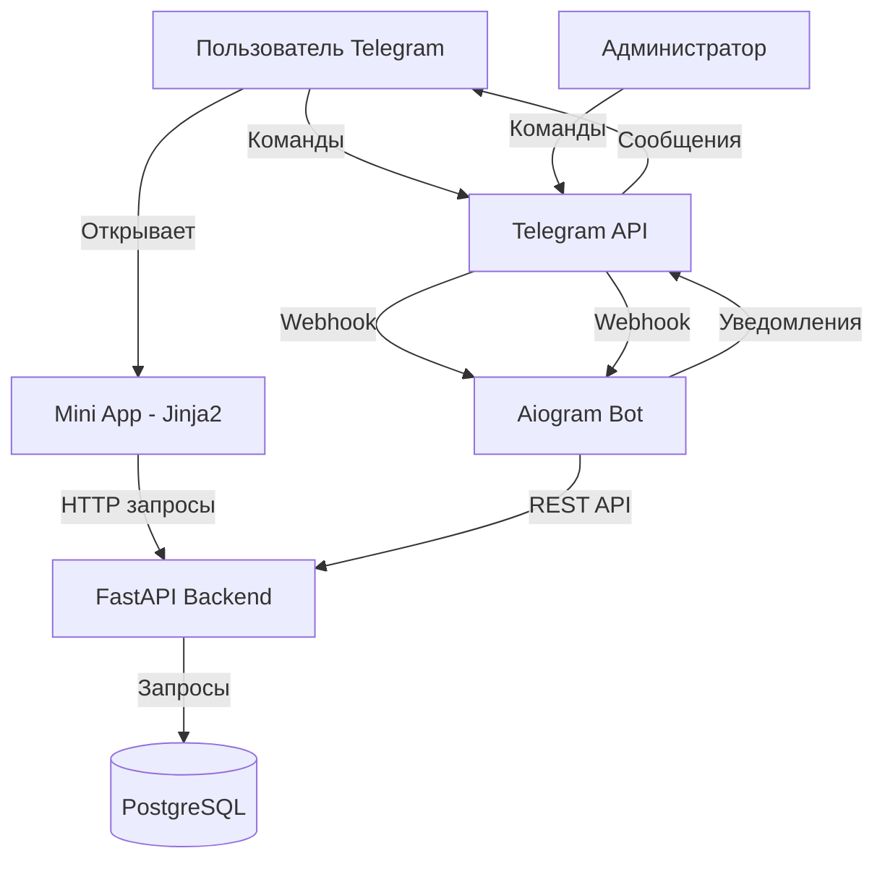

# Design Document

## Overview

Система состоит из трех основных компонентов:
1. **Telegram Bot** - Python бот на базе aiogram для обработки команд и взаимодействия с пользователями
2. **Web Application** - FastAPI приложение с Jinja2 шаблонами для Mini App, отображающее меню и профиль пользователя
3. **Database** - PostgreSQL для хранения данных пользователей, меню, заказов и транзакций

Бот и веб-приложение взаимодействуют через REST API. FastAPI обрабатывает запросы от Mini App и предоставляет API endpoints для бота. Aiogram бот обрабатывает webhook'и от Telegram и управляет коммуникацией с пользователями.

## Architecture



### Technology Stack

**Bot:**
- Python 3.11+
- aiogram 3.x - для работы с Telegram Bot API
- aiohttp - для HTTP запросов к API
- pydantic - для валидации данных
- python-dotenv - для конфигурации

**Web Application:**
- Python 3.11+
- FastAPI - веб-фреймворк и REST API
- Jinja2 - шаблонизатор для Mini App
- SQLAlchemy - ORM для работы с базой данных
- Alembic - миграции базы данных
- Pydantic - валидация данных
- uvicorn - ASGI сервер

**Database:**
- PostgreSQL 15+

**Frontend (в Jinja2 шаблонах):**
- HTML/CSS/JavaScript
- Telegram Web App SDK (через CDN)
- TailwindCSS (через CDN) - стилизация

## Components and Interfaces

### 1. Telegram Bot Handler

Обрабатывает входящие команды и сообщения от пользователей.

**Основные команды:**
- `/start [referral_code]` - регистрация пользователя, опционально с реферальным кодом
- `/menu` - открыть Mini App с меню
- `/profile` - открыть профиль в Mini App
- `/referral` - получить реферальную ссылку
- `/help` - справка по командам

**Административные команды:**
- `/admin_add_item` - добавить позицию в меню
- `/admin_edit_item` - редактировать позицию
- `/admin_create_promo` - создать акцию
- `/admin_broadcast` - запустить рассылку акции
- `/admin_set_level <username> <level>` - назначить уровень пользователю

### 2. User Service

Управляет пользователями и их данными.

```python
class UserService:
    async def create_user(
        self, 
        telegram_id: int, 
        username: str | None = None, 
        referrer_id: int | None = None
    ) -> User:
        ...
    
    async def get_user_by_telegram_id(self, telegram_id: int) -> User | None:
        ...
    
    async def update_user_status(self, user_id: int, is_active: bool) -> None:
        ...
    
    async def get_user_referrals(self, user_id: int) -> list[User]:
        ...
    
    async def set_user_level(self, user_id: int, level_id: int) -> None:
        ...
```

### 3. Loyalty Service

Управляет баллами лояльности и уровнями.

```python
class LoyaltyService:
    async def add_points(
        self, 
        user_id: int, 
        amount: float, 
        reason: str, 
        order_id: int | None = None
    ) -> None:
        ...
    
    async def deduct_points(self, user_id: int, amount: float, reason: str) -> None:
        ...
    
    async def get_points_balance(self, user_id: int) -> float:
        ...
    
    async def get_points_history(self, user_id: int) -> list[PointsTransaction]:
        ...
    
    async def calculate_level_for_user(self, user_id: int) -> LoyaltyLevel:
        ...
    
    async def update_user_level(self, user_id: int) -> None:
        ...
    
    async def get_levels(self) -> list[LoyaltyLevel]:
        ...
    
    async def create_level(
        self, 
        name: str, 
        threshold: float, 
        points_rate: float
    ) -> LoyaltyLevel:
        ...
```

### 4. Referral Service

Управляет реферальной системой.

```python
class ReferralService:
    async def generate_referral_code(self, user_id: int) -> str:
        ...
    
    async def get_referral_link(self, user_id: int) -> str:
        ...
    
    async def register_referral(self, referee_id: int, referral_code: str) -> None:
        ...
    
    async def process_referral_reward(
        self, 
        order_id: int, 
        referee_id: int, 
        order_amount: float
    ) -> None:
        ...
    
    async def get_referral_stats(self, user_id: int) -> ReferralStats:
        ...
```

### 5. Order Service

Управляет заказами пользователей.

```python
class OrderService:
    async def create_order(
        self, 
        user_id: int, 
        items: list[OrderItemCreate], 
        total_amount: float
    ) -> Order:
        ...
    
    async def get_order_by_id(self, order_id: int) -> Order | None:
        ...
    
    async def get_user_orders(self, user_id: int) -> list[Order]:
        ...
    
    async def process_order_rewards(self, order_id: int) -> None:
        ...
```

### 6. Menu Service

Управляет меню бара и синхронизацией с Google Sheets.

```python
class MenuService:
    async def get_menu(self) -> list[MenuCategory]:
        ...
    
    async def get_menu_item(self, item_id: int) -> MenuItem | None:
        ...
    
    async def create_menu_item(self, data: MenuItemCreate) -> MenuItem:
        ...
    
    async def update_menu_item(self, item_id: int, data: MenuItemUpdate) -> MenuItem:
        ...
    
    async def delete_menu_item(self, item_id: int) -> None:
        ...
    
    async def get_menu_by_category(self, category_id: int) -> list[MenuItem]:
        ...
    
    async def sync_menu_from_google_sheets(self, spreadsheet_id: str, range_name: str) -> dict:
        """
        Синхронизирует меню из Google Sheets.
        Возвращает статистику: {added: int, updated: int, errors: list}
        """
        ...
```

### 7. Promotion Service

Управляет акциями.

```python
class PromotionService:
    async def create_promotion(self, data: PromotionCreate) -> Promotion:
        ...
    
    async def get_active_promotions(self) -> list[Promotion]:
        ...
    
    async def broadcast_promotion(self, promotion_id: int) -> None:
        ...
```

### 8. Notification Service

Отправляет уведомления пользователям через бота.

```python
class NotificationService:
    async def send_message(
        self, 
        telegram_id: int, 
        message: str, 
        reply_markup: InlineKeyboardMarkup | None = None
    ) -> None:
        ...
    
    async def send_promotion(self, telegram_id: int, promotion: Promotion) -> None:
        ...
    
    async def send_level_up_notification(
        self, 
        telegram_id: int, 
        new_level: LoyaltyLevel
    ) -> None:
        ...
    
    async def send_referral_reward_notification(
        self, 
        telegram_id: int, 
        amount: float, 
        referee_name: str
    ) -> None:
        ...
    
    async def broadcast_to_active_users(
        self, 
        message: str, 
        reply_markup: InlineKeyboardMarkup | None = None
    ) -> None:
        ...
```

### 9. REST API Endpoints

**User Endpoints:**
- `GET /api/user/profile` - получить профиль пользователя
- `GET /api/user/stats` - получить статистику пользователя

**Loyalty Endpoints:**
- `GET /api/loyalty/balance` - получить баланс баллов
- `GET /api/loyalty/history` - получить историю транзакций
- `GET /api/loyalty/levels` - получить все уровни лояльности

**Referral Endpoints:**
- `GET /api/referral/link` - получить реферальную ссылку
- `GET /api/referral/stats` - получить статистику рефералов

**Menu Endpoints:**
- `GET /api/menu` - получить меню
- `GET /api/menu/categories` - получить категории
- `GET /api/menu/item/:id` - получить позицию меню

**Order Endpoints:**
- `POST /api/order` - создать заказ
- `GET /api/order/history` - получить историю заказов

## Data Models

### User
```python
class User(Base):
    __tablename__ = "users"
    
    id: Mapped[int] = mapped_column(primary_key=True)
    telegram_id: Mapped[int] = mapped_column(unique=True, index=True)
    username: Mapped[str | None]
    first_name: Mapped[str | None]
    last_name: Mapped[str | None]
    is_active: Mapped[bool] = mapped_column(default=True)
    loyalty_points: Mapped[float] = mapped_column(default=0.0)
    total_spent: Mapped[float] = mapped_column(default=0.0)
    loyalty_level_id: Mapped[int] = mapped_column(ForeignKey("loyalty_levels.id"))
    referrer_id: Mapped[int | None] = mapped_column(ForeignKey("users.id"))
    referral_code: Mapped[str] = mapped_column(unique=True, index=True)
    created_at: Mapped[datetime] = mapped_column(default=datetime.utcnow)
    updated_at: Mapped[datetime] = mapped_column(default=datetime.utcnow, onupdate=datetime.utcnow)
```

### LoyaltyLevel
```python
class LoyaltyLevel(Base):
    __tablename__ = "loyalty_levels"
    
    id: Mapped[int] = mapped_column(primary_key=True)
    name: Mapped[str]
    threshold: Mapped[float]  # минимальная сумма потраченных денег
    points_rate: Mapped[float]  # процент начисления баллов (например, 5.0 = 5%)
    order: Mapped[int]  # порядок уровня
    created_at: Mapped[datetime] = mapped_column(default=datetime.utcnow)
    updated_at: Mapped[datetime] = mapped_column(default=datetime.utcnow, onupdate=datetime.utcnow)
```

### PointsTransaction
```python
class PointsTransaction(Base):
    __tablename__ = "points_transactions"
    
    id: Mapped[int] = mapped_column(primary_key=True)
    user_id: Mapped[int] = mapped_column(ForeignKey("users.id"), index=True)
    amount: Mapped[float]  # положительное для начисления, отрицательное для списания
    reason: Mapped[str]
    order_id: Mapped[int | None] = mapped_column(ForeignKey("orders.id"))
    created_at: Mapped[datetime] = mapped_column(default=datetime.utcnow)
```

### Order
```python
from enum import Enum

class OrderStatus(str, Enum):
    PENDING = "PENDING"
    COMPLETED = "COMPLETED"
    CANCELLED = "CANCELLED"

class Order(Base):
    __tablename__ = "orders"
    
    id: Mapped[int] = mapped_column(primary_key=True)
    user_id: Mapped[int] = mapped_column(ForeignKey("users.id"), index=True)
    total_amount: Mapped[float]
    status: Mapped[OrderStatus] = mapped_column(default=OrderStatus.PENDING)
    created_at: Mapped[datetime] = mapped_column(default=datetime.utcnow)
    updated_at: Mapped[datetime] = mapped_column(default=datetime.utcnow, onupdate=datetime.utcnow)
    
    items: Mapped[list["OrderItem"]] = relationship(back_populates="order")
```

### OrderItem
```python
class OrderItem(Base):
    __tablename__ = "order_items"
    
    id: Mapped[int] = mapped_column(primary_key=True)
    order_id: Mapped[int] = mapped_column(ForeignKey("orders.id"), index=True)
    menu_item_id: Mapped[int] = mapped_column(ForeignKey("menu_items.id"))
    quantity: Mapped[int]
    price: Mapped[float]
    
    order: Mapped["Order"] = relationship(back_populates="items")
```

### MenuItem
```python
class MenuItem(Base):
    __tablename__ = "menu_items"
    
    id: Mapped[int] = mapped_column(primary_key=True)
    name: Mapped[str]
    description: Mapped[str | None]
    price: Mapped[float]
    image_url: Mapped[str | None]
    category_id: Mapped[int] = mapped_column(ForeignKey("menu_categories.id"), index=True)
    is_available: Mapped[bool] = mapped_column(default=True)
    created_at: Mapped[datetime] = mapped_column(default=datetime.utcnow)
    updated_at: Mapped[datetime] = mapped_column(default=datetime.utcnow, onupdate=datetime.utcnow)
```

### MenuCategory
```python
class MenuCategory(Base):
    __tablename__ = "menu_categories"
    
    id: Mapped[int] = mapped_column(primary_key=True)
    name: Mapped[str]
    order: Mapped[int]
    
    items: Mapped[list["MenuItem"]] = relationship()
```

### Promotion
```python
class Promotion(Base):
    __tablename__ = "promotions"
    
    id: Mapped[int] = mapped_column(primary_key=True)
    title: Mapped[str]
    description: Mapped[str]
    image_url: Mapped[str | None]
    start_date: Mapped[datetime]
    end_date: Mapped[datetime]
    created_at: Mapped[datetime] = mapped_column(default=datetime.utcnow)
```

### ReferralStats (Pydantic Schema)
```python
from pydantic import BaseModel

class ReferralInfo(BaseModel):
    user: User
    earned_from_user: float

class ReferralStats(BaseModel):
    total_referrals: int
    total_earned: float
    referrals: list[ReferralInfo]
```


## Correctness Properties

*A property is a characteristic or behavior that should hold true across all valid executions of a system-essentially, a formal statement about what the system should do. Properties serve as the bridge between human-readable specifications and machine-verifiable correctness guarantees.*

### User Registration and Notifications

**Property 1: New user registration creates database record**
*For any* new Telegram user with valid telegramId, when they execute /start command, the system should create a User record in the database with that telegramId.
**Validates: Requirements 1.2**

**Property 2: Active users receive promotion broadcasts**
*For any* set of users (active and inactive) and any promotion, when a broadcast is sent, only users with isActive=true should receive the notification.
**Validates: Requirements 1.1**

**Property 3: Promotion messages contain required information**
*For any* promotion, the notification message should contain the promotion description, start date, end date, and a button to open Mini App.
**Validates: Requirements 1.3**

**Property 4: Blocking bot deactivates user**
*For any* user, when they block the bot, the user's isActive field should be set to false in the database.
**Validates: Requirements 1.4**

### Menu Display

**Property 5: Menu API returns all categories and items**
*For any* menu request, the API should return all menu categories with their associated items where isAvailable=true.
**Validates: Requirements 2.1**

**Property 6: Category filtering returns only matching items**
*For any* category selection, the returned items should all have categoryId matching the selected category.
**Validates: Requirements 2.2**

**Property 7: Menu items with images include image URLs**
*For any* menu item with imageUrl not null, the API response should include that imageUrl field.
**Validates: Requirements 2.3**

**Property 8: Menu item response contains all required fields**
*For any* menu item, the API response should include name, description, price, and isAvailable fields.
**Validates: Requirements 2.4**

### Loyalty Points and Levels

**Property 9: Order completion awards proportional points**
*For any* completed order with amount A and user with loyalty level having pointsRate R, the user should receive A * (R/100) loyalty points.
**Validates: Requirements 3.1, 3.7**

**Property 10: Order completion increases total spent**
*For any* user with totalSpent T and completed order with amount A, after order processing the user's totalSpent should equal T + A.
**Validates: Requirements 3.2**

**Property 11: Reaching threshold triggers level up**
*For any* user with totalSpent below level threshold L, when an order increases totalSpent to >= L, the user's loyaltyLevelId should be updated to that level and a notification should be sent.
**Validates: Requirements 3.3**

**Property 12: Profile API returns complete loyalty data**
*For any* user profile request, the response should include loyaltyPoints, loyaltyLevel, and progress to next level.
**Validates: Requirements 3.4**

**Property 13: Points history returns all transactions**
*For any* user with N points transactions, the history API should return all N transactions with amount, reason, and timestamp.
**Validates: Requirements 3.5**

**Property 14: Points balance changes persist immediately**
*For any* points transaction (add or deduct), reading the user's loyaltyPoints from database immediately after should reflect the new balance.
**Validates: Requirements 3.6**

### Loyalty Levels Management

**Property 15: Level creation persists all fields**
*For any* loyalty level with name N, threshold T, and pointsRate R, after creation, reading that level from database should return all three fields with matching values.
**Validates: Requirements 4.2**

**Property 16: Levels API returns all levels with details**
*For any* levels request, the API should return all loyalty levels with name, threshold, and pointsRate fields.
**Validates: Requirements 4.3**

**Property 17: User level matches highest qualifying threshold**
*For any* user with totalSpent S and set of levels with thresholds, the calculated level should be the one with highest threshold <= S.
**Validates: Requirements 4.4**

**Property 18: Manual level assignment overrides automatic calculation**
*For any* user with totalSpent below level L's threshold, when admin manually assigns level L, the user's loyaltyLevelId should be set to L.
**Validates: Requirements 4.5**

**Property 19: Manual level assignment sends notification**
*For any* manual level assignment to user U with level L, a notification should be sent to user U's telegramId.
**Validates: Requirements 4.6**

### Referral System

**Property 20: Referral codes are unique per user**
*For any* set of users, all generated referral codes should be unique (no two users have the same code).
**Validates: Requirements 5.1**

**Property 21: Referral registration creates persistent link**
*For any* new user registering with valid referral code C belonging to user R, the new user's referrerId field should be set to R's id.
**Validates: Requirements 5.2, 5.6**

**Property 22: Referee order awards 1% to referrer**
*For any* referee with referrerId R completing order with amount A, the referrer R should receive A * 0.01 loyalty points.
**Validates: Requirements 5.3**

**Property 23: Referee order triggers referrer notification**
*For any* referee completing an order, a notification should be sent to their referrer's telegramId with the earned points amount.
**Validates: Requirements 5.4**

**Property 24: Referral stats show complete data**
*For any* referrer with N referees, the stats API should return count of N and sum of all points earned from those referees' orders.
**Validates: Requirements 5.5**

### Menu and Promotion Management

**Property 25: Created menu items are accessible via API**
*For any* menu item created by admin, a subsequent GET request to menu API should include that item.
**Validates: Requirements 6.1**

**Property 26: Menu item updates persist immediately**
*For any* menu item with price P, after updating to price P2, reading that item from database should return price P2.
**Validates: Requirements 6.2**

**Property 27: Promotion creation persists all fields**
*For any* promotion with title, description, startDate, and endDate, after creation, reading from database should return all fields with matching values.
**Validates: Requirements 6.3**

**Property 28: Deleted menu items marked unavailable but preserved**
*For any* menu item with id I, after deletion, the item should exist in database with isAvailable=false.
**Validates: Requirements 6.4**

**Property 29: Promotion broadcast reaches all active users**
*For any* promotion broadcast with N active users, N notification attempts should be made (one per active user).
**Validates: Requirements 6.5**

### User Statistics

**Property 30: Profile includes all required statistics**
*For any* user profile request, the response should include loyaltyPoints, referral count, and createdAt date.
**Validates: Requirements 7.1**

**Property 31: Order history returns all user orders**
*For any* user with N orders, the order history API should return all N orders with dates and amounts.
**Validates: Requirements 7.2**

**Property 32: Referral statistics show complete referee data**
*For any* referrer with referees, the stats should include list of all referees and points earned from each.
**Validates: Requirements 7.3**

### Security and Data Integrity

**Property 33: Points transactions are logged with metadata**
*For any* points change (add or deduct), a PointsTransaction record should be created with amount, reason, and timestamp.
**Validates: Requirements 8.2**

**Property 34: Referral rewards require valid relationship**
*For any* order by user U, referral points should only be awarded if U has a non-null referrerId that exists in the database.
**Validates: Requirements 8.3**

**Property 35: User data requests return only own data**
*For any* user U requesting data, the response should only include records where userId = U's id.
**Validates: Requirements 8.4**

### Error Handling

**Property 36: Notification errors don't stop broadcast**
*For any* broadcast to N users where user i causes error, notifications should still be attempted for all other N-1 users.
**Validates: Requirements 9.2**

## Error Handling

### Input Validation

1. **Referral Code Validation**: Prevent users from using their own referral code
   - Check if referral code belongs to the registering user
   - Return error message if self-referral detected

2. **Order Amount Validation**: Reject orders with invalid amounts
   - Check amount > 0 before processing
   - Log error and return validation message for invalid amounts

3. **Promotion Date Validation**: Ensure valid date ranges
   - Verify endDate > startDate before creating promotion
   - Return error message for invalid date ranges

### Database Error Handling

1. **Connection Failures**: Implement retry logic with exponential backoff
   - Initial retry after 30 seconds
   - Maximum 3 retry attempts
   - Return user-friendly error message after max retries

2. **Transaction Failures**: Rollback on any error during multi-step operations
   - Use database transactions for order processing
   - Rollback if any step fails (order creation, points award, referral reward)

### External API Error Handling

1. **Telegram API Failures**: Handle rate limits and network errors
   - Implement queue for message sending
   - Retry failed messages with exponential backoff
   - Log all failures for monitoring

2. **Webhook Processing**: Handle malformed or unexpected payloads
   - Validate webhook signature
   - Log and ignore invalid payloads
   - Return 200 OK to prevent retries

### Logging Strategy

1. **Error Logs**: All errors with stack traces and context
2. **Transaction Logs**: All points transactions with user ID and reason
3. **Admin Action Logs**: All administrative actions with timestamp and admin ID
4. **Notification Logs**: All sent notifications with success/failure status

## Testing Strategy

### Unit Testing

**Framework**: pytest для backend и бота

**Backend Unit Tests:**
- Service layer methods (UserService, LoyaltyService, ReferralService, etc.)
- Business logic functions (level calculation, points calculation, referral validation)
- Input validation functions (Pydantic schemas)
- Error handling scenarios
- API endpoints

**Bot Unit Tests:**
- Command handlers
- Message formatting functions
- Callback handlers

**Example Unit Tests:**
- Test that calculate_level_for_user returns correct level for given total_spent
- Test that generate_referral_code produces valid format
- Test that validate_order_amount rejects zero and negative values
- Test that format_promotion_message includes all required fields

### Property-Based Testing

**Framework**: fast-check for TypeScript

**Configuration**: Each property test should run minimum 100 iterations

**Test Tagging**: Each property-based test must include a comment with format:
```typescript
// Feature: telegram-bar-bot, Property {number}: {property_text}
```

**Property Test Coverage:**
- User registration and notification properties (Properties 1-4)
- Menu display and filtering properties (Properties 5-8)
- Loyalty points calculation properties (Properties 9-14)
- Loyalty level management properties (Properties 15-19)
- Referral system properties (Properties 20-24)
- Menu and promotion management properties (Properties 25-29)
- User statistics properties (Properties 30-32)
- Security and data integrity properties (Properties 33-35)
- Error handling properties (Property 36)

**Example Property Tests:**
```typescript
// Feature: telegram-bar-bot, Property 9: Order completion awards proportional points
fc.assert(
  fc.property(
    fc.record({
      orderAmount: fc.float({ min: 0.01, max: 10000 }),
      pointsRate: fc.integer({ min: 1, max: 20 })
    }),
    async ({ orderAmount, pointsRate }) => {
      const user = await createTestUser({ pointsRate });
      const initialPoints = user.loyaltyPoints;
      await processOrder(user.id, orderAmount);
      const updatedUser = await getUserById(user.id);
      const expectedPoints = initialPoints + (orderAmount * pointsRate / 100);
      expect(updatedUser.loyaltyPoints).toBeCloseTo(expectedPoints, 2);
    }
  ),
  { numRuns: 100 }
);
```

### Integration Testing

**Scope**: Test interactions between components
- Bot command handlers with services
- REST API endpoints with database
- Service layer with database operations
- Notification service with Telegram API (mocked)

**Test Database**: Use separate test database with migrations

**Example Integration Tests:**
- Test /start command creates user and sends welcome message
- Test POST /api/order creates order, awards points, and processes referral
- Test promotion broadcast sends to all active users

### End-to-End Testing

**Framework**: Playwright for Mini App frontend

**Scope**:
- User flows through Mini App (view menu, view profile, view stats)
- Bot command flows (registration, referral link generation)

**Test Environment**: Staging environment with test Telegram bot

### Test Data Generation

**Strategy**: Use factories and builders for test data
- UserFactory for creating test users
- OrderFactory for creating test orders
- MenuItemFactory for creating test menu items
- PromotionFactory for creating test promotions

**Cleanup**: Reset test database between test suites

### Continuous Integration

**CI Pipeline**:
1. Run linting and type checking
2. Run unit tests
3. Run property-based tests
4. Run integration tests
5. Generate coverage report (target: 80% coverage)

**Pre-commit Hooks**:
- Run linting
- Run unit tests for changed files
